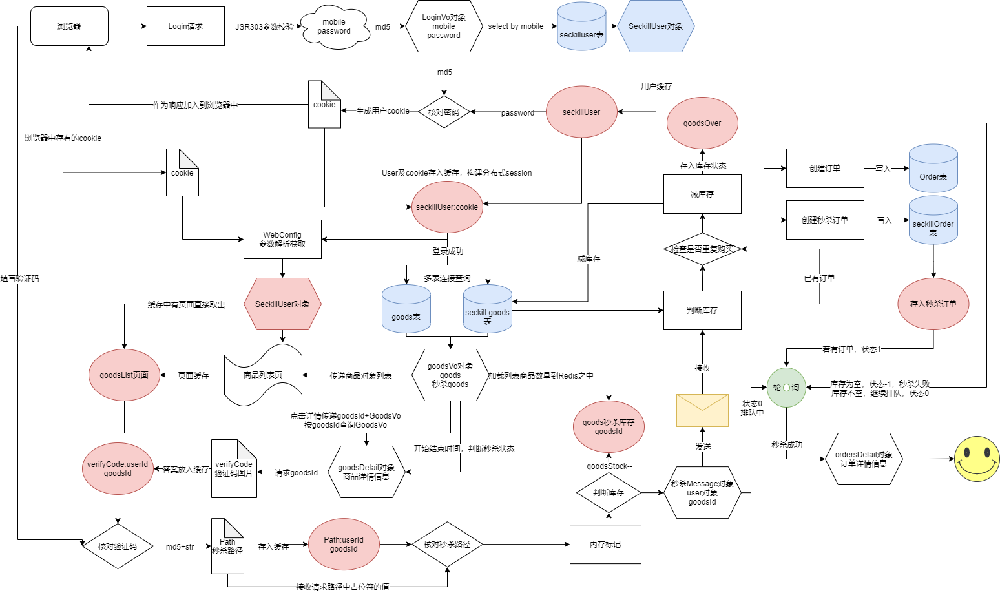

# 秒杀系统实现
 

|功能模块|1|2|3|4|
|----|----|----|----|----|
|用户登录|数据库设计|两次MD5|JSR303参数校验和全局异常处理|分布式Session|
|实现秒杀功能|数据库设计|商品列表页|商品详情页|订单详情页|
|JMeter压测|JMeter使用|模拟多用户|JMeter命令行使用||
|页面优化技术|页面+URL+对象缓存|页面静态化|静态资源优化|CDN优化|
|接口优化|Redis预减库存|内存标记|RabbitMQ异步下单|访问Nginx水平扩展|
|安全优化|秒杀接口地址隐藏|数学公式验证码|接口防刷|流量控制|
|配置优化|Tomcat配置优化|Ngnix配置|LVS四层均衡负载|Keepalived高可用|
